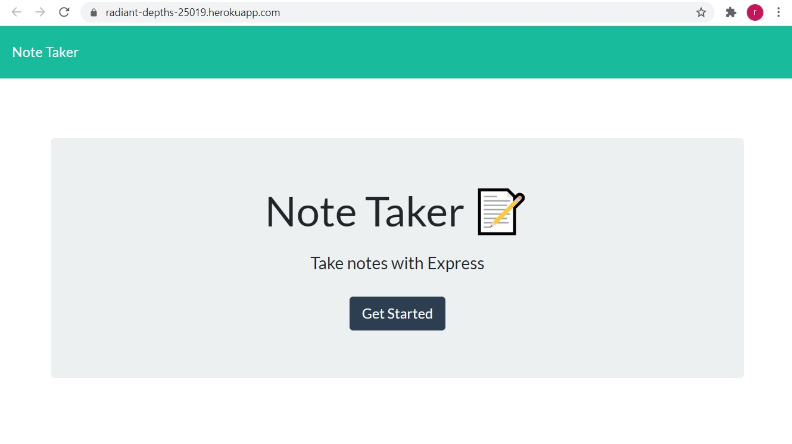

# notetaker

## Description 
This application will allow you to create, store, and delete notes for your personal usage. 

## Website Link 
https://radiant-depths-25019.herokuapp.com/

## Screenshots

## Usage 
The application is simple to use. Once you navigate to the home page you will click on the get started button. After this you will be sent to the notes page where you will input a note title and enter the body text of your note. Once you have completed your note you can press the save icon in the top right hand corner of the page. To review saved notes click on the note title in the left hand column. Finally to delete a note you no longer need press the delete icon in the left hand column on the note row that you specify.

## Technologies Used
Javascript, Node, Express, Heroku, CSS, HTML, JQUERY